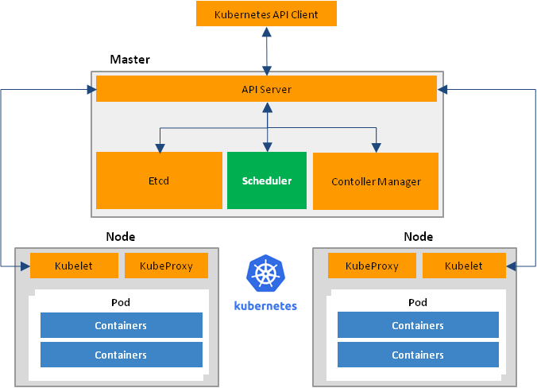
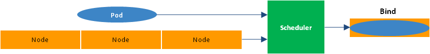
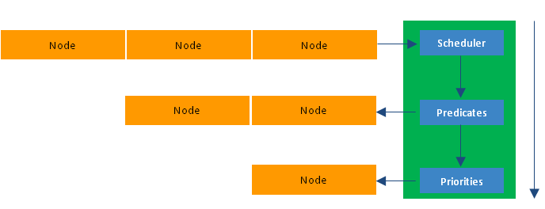
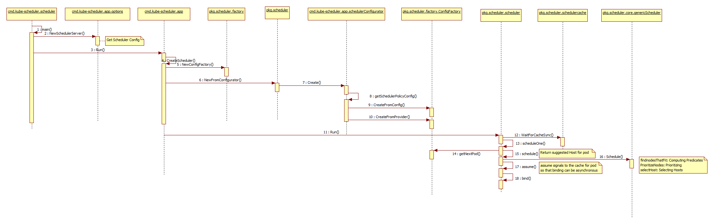
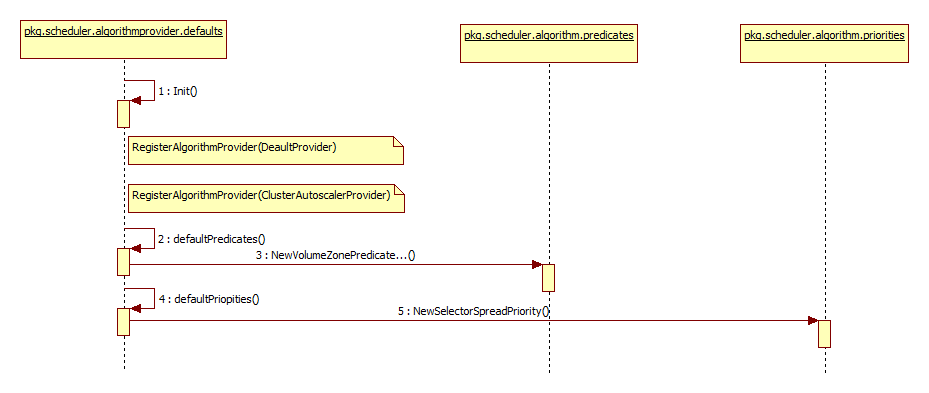

# Kubernetes Scheduler

## 1. Scheduler Introducation

The Kubernetes Scheduler runs as a process alongside the other master components such as the API server.
Its interface to the API server is to watch for Pods with an empty ```PodSpec.NodeName```,
and for each Pod, it posts a binding indicating where the Pod should be scheduled.



## 2. Scheduler Workflow

The Kubernetes Scheduler is focused on scheduling pods into specified working nodes by scheduling algorithm,
which is also called ```Bind```. The input of Scheduler is the pods which need to be scheduled and the nodes which could be scheduled into,
and the output of Scheduler is ```Bind``` which connects between pods and nodes.



The Kubernetes Scheduler tries to find a node for each Pod, one at a time.

- First it applies a set of "predicates" to filter out inappropriate nodes.
  For example, if the PodSpec specifies resource requests,
  then the Scheduler will filter out nodes that don't have enough available resources.

- Second it applies a set of "priority functions" that rank the nodes that weren't filtered out by the predicate check.
  For example, it tries to spread Pods across nodes and zones while at the same time favoring the least loaded nodes.

- Finally the node with the highest priority is chosen,
  if there are multiple such nodes, then one of them is chosen at random.



## 3. Scheduler Code Analysis

Scheduler main implementations include ```plugin/cmd/kube-scheduler``` and ```plugin/pkg/scheduler```.

- ```plugin/cmd/kube-scheduler``` starts the Scheduler process and reads the configurations from Command Line Interface and so on.

- ```plugin/pkg/scheduler/algorithm``` includes two kinds of scheduling algorithms: ```predicates``` and ```priorities```.

- ```plugin/pkg/scheduler/algorithmprovider``` is used to register and configure Scheduler algorithm providers.

- ```plugin/pkg/scheduler/factory``` creates scheduling algorithm and scheduling parameters.

- ```plugin/pkg/scheduler/scheduler.go``` is the main class of Scheduler.

- ```plugin/pkg/scheduler/core/generic_scheduler.go``` invokes the detail scheduling algorithm.

The entrance of Scheduler is ```plugin/cmd/kube-scheduler/scheduler.go```.

- First Scheduler creates ```configFactory``` and then creates ```config```.

- If it specifies policy-config-file, Scheduler will create ```config``` by policy-config-file (CreateFromConfig),

- If not, Scheduler will create ```config``` by Scheduler algorithm providers (CreateFromProvider),

- After Scheduler has got all the parameters, the scheduling work will be executed in ```plugin/pkg/scheduler/scheduler.go```.

- Scheduler invokes ```scheduleOne``` function and ```getNextPod``` from pod queue.

- Then Scheduler executes ```schedule``` function, and actually the schedule process will be executed in ```plugin/pkg/scheduler/core/generic_scheduler.go```.

- If the operation is successful, the Scheduler will get the most fit node for this pod.

- Then Scheduler will tell the cache to assume that a pod now is running on a given node,
  even though it hasn't been bound yet. This allows Scheduler to keep scheduling without waiting on binding to occur.

- At last Scheduler will bind the pod to its node asynchronously by invoking Kubernetes APIServer Bind interface.



The Kubernetes Scheduler is able to find the most fit node for pods.
The actual scheduling steps include: ```predicates``` and ```priorities```.
The default algorithm provider is ```DefaultProvider``` which can be specified
by setting the parameter ```--algorithm-provider string``` when starting the Scheduler.



```DefaultProvider``` is registered by two functions ```defaultPredicates``` and ```defaultPriorities```.
Also these two functions can be configured by setting the parameter ```--policy-config-file string```.
Here is the example about scheduler-policy-config.json.

```yaml

{
  "kind" : "Policy",
  "apiVersion" : "v1",
  "predicates" : [
  {"name" : "PodFitsHostPorts"},
  {"name" : "PodFitsResources"},
  {"name" : "NoDiskConflict"},
  {"name" : "NoVolumeZoneConflict"},
  {"name" : "MatchNodeSelector"},
  {"name" : "HostName"}
  ],
  "priorities" : [
  {"name" : "LeastRequestedPriority", "weight" : 1},
  {"name" : "BalancedResourceAllocation", "weight" : 1},
  {"name" : "ServiceSpreadingPriority", "weight" : 1},
  {"name" : "EqualPriority", "weight" : 1}
  ],
  "hardPodAffinitySymmetricWeight" : 10
}

```

## 4. Scheduler Algorithm

### 4.1 Default Predicates

#### 4.1.1 NoVolumeZoneConflict

Evaluate if the volumes that a pod requests are available on the node, given the Zone restrictions.

#### 4.1.2 MaxEBSVolumeCount

Ensure that the number of attached ElasticBlockStore volumes does not exceed a maximum value
(by default, 39, since Amazon recommends a maximum of 40 with one of those is reserved for the root volume --
see [Amazon's documentation](http://docs.aws.amazon.com/AWSEC2/latest/UserGuide/volume_limits.html#linux-specific-volume-limits)).
The maximum value can be controlled by setting the ```KUBE_MAX_PD_VOLS``` environment variable.

#### 4.1.3 MaxGCEPDVolumeCount

Ensure that the number of attached GCE PersistentDisk volumes does not exceed a maximum value
(by default, 16, which is the maximum GCE allows --
see [GCE's documentation](https://cloud.google.com/compute/docs/disks/add-persistent-disk#limits_for_predefined_machine_types)).
The maximum value can be controlled by setting the ```KUBE_MAX_PD_VOLS``` environment variable.

#### 4.1.4 MaxAzureDiskVolumeCount

Ensure that the number of attached Azure volumes does not exceed a maximum value (by default, 16).

#### 4.1.5 MatchInterPodAffinity

Fit is determined by inter-pod affinity.
AffinityAnnotationKey represents the key of affinity data (json serialized) in the Annotations of a Pod.

#### 4.1.6 NoDiskConflict

Evaluate if a pod can fit due to the volumes it requests,
and those that are already mounted. Currently supported volumes are:AWS EBS, GCE PD, ISCSI and Ceph RBD.
Only Persistent Volume Claims for those supported types are checked.
Persistent Volumes added directly to pods are not evaluated and are not constrained by this policy.

#### 4.1.7 GeneralPredicates

- PodFitsResources

  Check if the free resource (CPU and Memory) meets the requirement of the Pod.
  The free resource is measured by the capacity minus the sum of requests of all Pods on the node.
  To learn more about the resource QoS in Kubernetes, please check QoS proposal.

- PodFitsHost

  Filter out all nodes except the one specified in the PodSpec's NodeName field.

- PodFitsHostPorts

  Check if any HostPort required by the Pod is already occupied on the node.

- PodMatchNodeSelector

  PodMatchNodeSelector checks if a pod node selector matches the node label.

#### 4.1.8 CheckNodeMemoryPressure

Check if a pod can be scheduled on a node reporting memory pressure condition.
Currently, no BestEffort should be placed on a node under memory pressure as it gets automatically evicted by kubelet.

#### 4.1.9 CheckNodeDiskPressure

Check if a pod can be scheduled on a node reporting disk pressure condition.
Currently, no pods should be placed on a node under disk pressure as it gets automatically evicted by kubelet.

#### 4.1.10 NoVolumeNodeConflict

Fit is determined by volume zone requirements.

#### 4.1.11 PodToleratesNodeTaints

Fit is determined based on whether a pod can tolerate all of the node's taints.

### 4.2 Default Priorities

```FinalScoreNode = (Weight1 * priorityFunc1) + (Weight2 * priorityFunc2) + ... + (Weightn * priorityFuncn)```

#### 4.2.1 SelectorSpreadPriority

Spread Pods by minimizing the number of Pods belonging to the same service,
replication controller, or replica set on the same node.
If zone information is present on the nodes,
the priority will be adjusted so that pods are spread across zones and nodes.

#### 4.2.2 InterPodAffinityPriority

Pods should be placed in the same topological domain (e.g. same node, same rack, same zone, same power domain, etc.)
as some other pods, or, conversely, should not be placed in the same topological domain as some other pods.

#### 4.2.3 LeastRequestedPriority

The node is prioritized based on the fraction of the node that would be free
if the new Pod were scheduled onto the node.
 (In other words, (capacity - sum of requests of all Pods already on the node - request of Pod that is being scheduled) / capacity).
CPU and memory are equally weighted. The node with the highest free fraction is the most preferred.
Note that this priority function has the effect of spreading Pods across the nodes with respect to resource consumption.

#### 4.2.4 BalancedResourceAllocation

This priority function tries to put the Pod on a node
such that the CPU and Memory utilization rate is balanced after the Pod is deployed.
score = 10 - abs(cpuFraction - memoryFraction) * 10

#### 4.2.5 NodePreferAvoidPodsPriority

Set this weight large enough to override all other priority functions.
The default weight is 100000.

#### 4.2.6 NodeAffinityPriority

Implements ```preferresDuringSchedulingIngnoredDuringExecution``` node affinity.

#### 4.2.7 TaintTolerationPriority

Prioritizes nodes that marked with taint which pod can tolerate.
