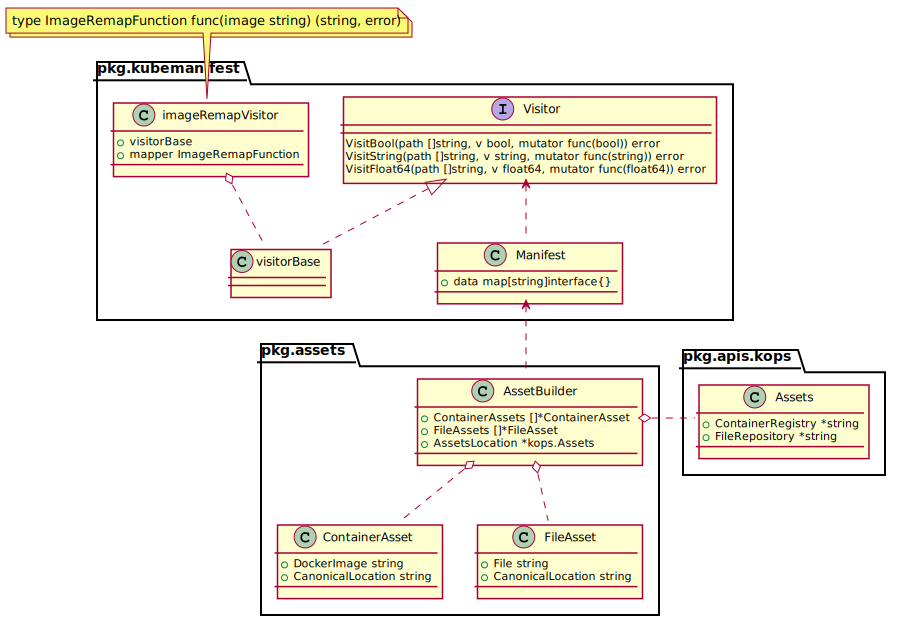
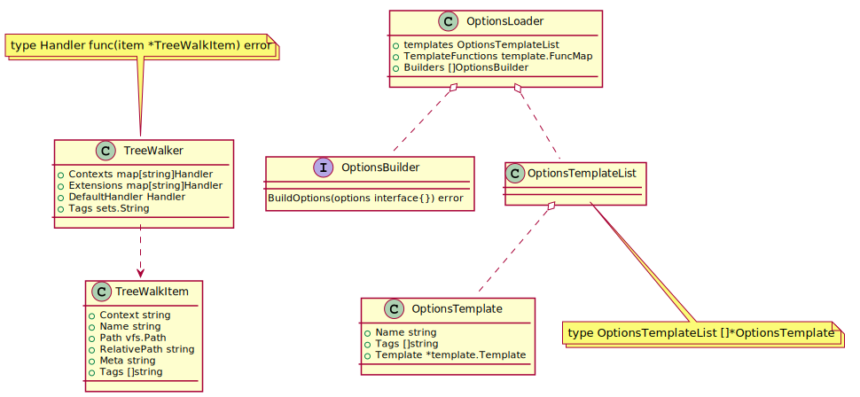

## pkg.Assets

### class diagram

### methods
1. RemapFile(file string) (string, error)

    RemapFile sets a new url location for the file, if a AssetsLocation is defined, and return the new location

1. RemapImage(image string) (string, error)

    RemapFile sets a new url location for the image, if a AssetsLocation is defined, and return the new location

1. RemapManifest(data []byte) ([]byte, error)

    RemapManifest transforms a kubernetes manifest which will remap the location of the image set in manifest, and return the new manifest.

## pkg.kubemanifest

Transforms a kubernetes manifest which will convert each values.

pkg.kubemanifest.visit: it tranverse the manifest by depth-first and convert each value of item.

## upup.models

Include all the configs and templates and implement the interface of util.pkg.vfs to visit each file

## upup.fi.loader

### class diagram

### TreeWakler

Tranverse the vfs directory and handle each file.

### OptionLoader

Converge the options and configuration templates to generate the united cluster spec.

First, merge config options located at upup.models.config to the cluster.spec

Second, each option builder at pkg.model.components will full fill the corresponding items in cluster.spec

## completed work flow
1. full fill cluster.spec

    1. Tranverse each file in upup.model.config to generate corresponding instance of upup.fi.loader.OptionsTemplate by method of upup.fi.loader.OptionsLoader.HandleOptions

    1. invoke upup.fi.loader.OptionsLoader.Build to full fill cluster.spec

1. full fill instancegroup

    see method of PopulateInstanceGroupSpec at upup/pkg/fi/cloudup/populate_instancegroup_spec.go

    There are two questions:
    1. Which kind of machine type is suitable for Openstack. see method of defaultMachineType 

    1. Which kind of machine image is suitable for Openstack, see method of defaultImage
