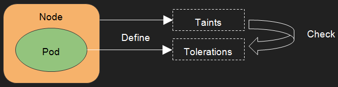

# Taints and Tolerations

## 1. Introducation

Taints and tolerations work together to ensure that pods are not scheduled onto inappropriate nodes.
One or more taints are applied to a node; this marks that the node should not accept any pods that do not tolerate the taints.
Tolerations are applied to pods, and allow the pods to schedule onto nodes with matching taints.



Node affinity is a property of pods that attracts them to a set of nodes.
Taints are the opposite and they allow a node to repel a set of pods.
If Node affinity could be called by ```White List```, Taints could be called by ```Black List```.

## 2. Operations

### Basis

Taints are defined for Kubernetes Cluster nodes in the ```annotations```,
and Tolerations are specified for Kubernetes pods in the ```PodSpec```.

The Scheduler will schedule the pods by lots of rules, including below:

* PodToleratesNodeTaints: one of the predicates rules.

  Judge whether Pod satisfy the conditions of node tolerance.

* TaintTolerationPriority: one of the priorities rules.

  Compare the TolerationList in Pod with the Taints in node, the more paired, the lower score.

### Taints

Kubernetes provides two ways to add Taints for node.

* Using command to add Taints.

  ```kubectl taint nodes [nodename] key=value:NoSchedule```

* Declare annotations for node.

  ```annotations: scheduler.alpha.kubernetes.io/taints: '[{"key": "alias", "operator": "Equal"}, "value": "edison", "effect": "NoSchedule" ]'```

The users can use the following command to delete Taints from node.

* Using command to delete Taints.

  ```kubectl taint nodes [nodename] key:NoSchedule-```

```operator``` could be defined by：

* Equal

  Whether the ```key``` is equal with the ```value```. This is the default ```Operator```.

* Exists

  Whether the ```key``` is existing. It is not necessary to specify the ```value```.

```effect``` could be defined by:

* NoSchedule

  If the Tolerations declared in the Pods don't match the Taints defined in the Node,
  it will not allow the Pods to schedule on the Node.

* PreferNoSchedule

  If the Tolerations declared in the Pods don't match the Taints defined in the Node,
  it will not schedule the Pods on the Node as far as possible.

* NoExecute

  If the Tolerations declared in the Pods don't match the Taints defined in the Node,
  it will not allow the Pods to schedule on the Node.
  If the pods have already been scheduled on the Node,
  the pods will be evicted from the node.
  If the Tolerations decalred ```TolerationSeconds```,
  the pods will be evicted from the node after ```TolerationSeconds```.
  If the Taints is deleted before ```TolerationSeconds```,
  the pod will not be evicted.

### Tolerations

Tolerations are specified for Kubernetes pods in the ```PodSpec``` like below:

```yaml

tolerations:
- key: "key1"
  operator: "Equal"
  value: "value1"
  effect: "NoSchedule"
- key: "key2"
  operator: "Exists"
  effect: "NoSchedule"
  tolerationSeconds: 600

```

Tolerations also include two kinds of ```operator```: ```Equal``` and ```Exists```,
and three kinds of ```effect```: ```NoSchedule```, ```PreferNoSchedule``` and ```NoExecute```.

The ```NoExecute``` Taints ```effect``` affects pods that are already running on the node as follows:

* Pods that do not tolerate the Taints are evicted immediately.

* Pods that tolerate the Taints without specifying ```tolerationSeconds``` remain in that node forever.

* Pods that tolerate the Taints with specifying ```tolerationSeconds``` remain in that node for the specified ```tolerationSeconds```.

### Taints&Tolerations

The users can define lots of Taints on Nodes and Tolerations on Pods.
The Scheduler will remain the nodes which match the Tolerations and filter the nodes which doesn't match. The process is like this:

* One or more un-matched NoSchedule Taints

  if there are one or more un-matched Taints with effect ```NoSchedule```,
  the Kubernetes will not schedule the pods on that node.

* One or more un-matched PreferNoSchedule Taints

  if there are no un-matched Taints with effect ```NoSchedule```,
  but there are one or more un-matched Taints with effect ```PreferNoSchedule```,
  the Kubernetes will try to not schedule the pods on that node.

* One or more un-matched NoExecute Taints

  if there are one or more Taints with effect ```NoExecute```,
  if the pods have already been running on that node, the pods will be evicted from that node,
  if not yet running, the pods will not be scheduled on that node.

## 3. Examples

### Add Pods into Master

In default, Kubernetes will not allow to add the pods into ```Master```,
If you want to add the pods into ```Master```, you can use the following command:

```kubectl taint nodes --all dedicated-```

### Dedicated Nodes

If you want to dedicate a set of nodes for exclusive use by a particular set of users,
you can add a taint to those nodes by using the following command:

```kubectl taint nodes [nodename] dedicated=groupName:NoSchedule```

### Nodes with Special Hardware

If you want to keep a part of nodes have special hardware,
for example you want to prorvide GPU for AI.
you can add a taint to the nodes that have the Special hardware.

```kubectl taint nodes [nodename] special=GPU:NoSchedule```

* [Refer Pages](https://github.com/kubernetes/community/blob/58b1c30d95719749068497ba35dfe4c64b21aa72/contributors/design-proposals/scheduling/taint-toleration-dedicated.md)

## 4. Taint based Evictions

Taint based Evictions is an alpha feature that causes the node controller to create Taints corresponding to node condition.
This feature is disabled in default, The users can switch on this feature by setting ```--feature-gates mapStringBool```
in [Kubernetes Controller Manager configuration](https://kubernetes.io/docs/admin/kube-controller-manager/)

* TaintBasedEvictions=true|false (ALPHA - default=false)

The built-in Taints currently include the below and so forth:

* node.alpha.kubernetes.io/unreachable

  Current node is unreachable from the node controller.

  ```Ready==Unknown```

* node.alpha.kubernetes.io/notReady

  Current node status is not ready.

  ```Ready==False```

* node.kubernetes.io/memoryPressure

  Current node has memory pressure.

* node.kubernetes.io/diskPressure

  Current node has memory pressure.

* node.kubernetes.io/network-unavailable

  Current node’s network is unavailable.

### Default Pods

```node.alpha.kubernetes.io/notReady``` and ```node.alpha.kubernetes.io/unreachable``` will be added into the pods by default.

[Added Codes](https://github.com/kubernetes/kubernetes/blob/master/plugin/pkg/admission/defaulttolerationseconds/admission.go#L66)

Tolerations for Default Pods:

```yaml

spec:
  containers:
  - image: nginx
    imagePullPolicy: Always
    name: nginx
  tolerations:
  - effect: NoExecute
    key: node.alpha.kubernetes.io/notReady
    operator: Exists
    tolerationSeconds: 300
  - effect: NoExecute
   key: node.alpha.kubernetes.io/unreachable
    operator: Exists
    tolerationSeconds: 300

```

This prevents massive pod evictions in scenarios such as the master becoming partitioned from the nodes.
These automatically-added tolerations ensure that the default pod behavior of remaining bound for 5 minutes
after one of these problems is detected is maintained.

### DaemonSet Pods

DaemonSet pods are created with ```NoExecute``` effect Tolerations for the following taints with no ```tolerationSeconds```:

* NoExecute

  node.alpha.kubernetes.io/unreachable

  node.kubernetes.io/not-ready

* NoSchedule

  node.kubernetes.io/diskPressure

  node.kubernetes.io/memoryPressure

Tolerations for DaemonSet Pods:

```yaml

spec:
  containers:
  - image: nginx
    imagePullPolicy: Always
    name: webserver
    ports:
    - containerPort: 80
      protocol: TCP
  tolerations:
  - effect: NoExecute
    key: node.alpha.kubernetes.io/notReady
    operator: Exists
  - effect: NoExecute
    key: node.alpha.kubernetes.io/unreachable
    operator: Exists
  - effect: NoSchedule
    key: node.kubernetes.io/diskPressure
    operator: Exists
  - effect: NoSchedule
    key: node.kubernetes.io/memoryPressure
    operator: Exists

```

This ensures that DaemonSet Pods are never evicted due to these problems.
Because DaemonSet should keep alive by itself design.

## 5. Taint Nodes by Condition

This feature is also disabled in default, The users can switch on this feature by setting ```--feature-gates mapStringBool```
in [Kubernetes Controller Manager configuration](https://kubernetes.io/docs/admin/kube-controller-manager/)

* TaintNodesByCondition=true|false (ALPHA - default=false)

Taint Nodes by Condition is also a alpha [feature]((https://github.com/kubernetes/community/blob/58b1c30d95719749068497ba35dfe4c64b21aa72/contributors/design-proposals/scheduling/taint-node-by-condition.md)).
The Scheduler will check Taints instead of node conditions.
This assures that node conditions will not affect pods scheduled on the Node.
The user can choose to ignore some of the node’s problems by adding Tolerations.

Replacing ```CheckNodeCondition``` with ```PodToleratesNodeTaints```:

```go

func ApplyFeatureGates() {
  predSet := defaultPredicates()
  if utilfeature.DefaultFeatureGate.Enabled(features.TaintNodesByCondition) {
    // Remove "CheckNodeCondition" predicate
    factory.RemoveFitPredicate("CheckNodeCondition")
    predSet.Delete("CheckNodeCondition")

    // Fit is determined based on whether a pod can tolerate all of the node's Taints
    predSet.Insert(factory.RegisterMandatoryFitPredicate("PodToleratesNodeTaints", predicates.PodToleratesNodeTaints))
    glog.Warningf("TaintNodesByCondition is enabled, PodToleratesNodeTaints predicate is mandatory")
  }
  registerAlgorithmProvider(predSet, defaultPriorities())
}

```
