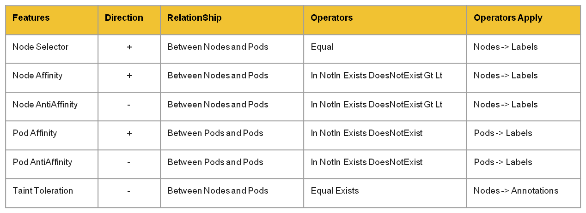

# Affinity and AntiAffinity

## 1. User Cases

In most cases, Kubernetes will assign the Pods to Nodes by the Scheduler automaticlly.
But in some special scenarios, the users expect to run some Pods in the particular Nodes.
For example, the users want to specify some Pods to run in the Nodes which have SSD,
or specify some kinds of Pods to run in the same Nodes or Zones together.
Kubernetes provides multiple ways to match these User Cases.
Affinity and AntiAffinity are that way for the Kubernetes users.
The examples are provided as following.

## 2. Node Selector

Node Selector is the simple way to specify the particular Nodes Scheduling.
In Kubernetes the Scheduler will compare the labels in the Nodes with the Node Selector in the Pods
to decide whether assign these Pods to the suitable Node.
The users may add labels for the Nodes by the below Commands.

### Commands

* ```kubectl label nodes [node-name] [label-key]=[label-value]```

  This command is used to add labels for Nodes.

  That label keys are not allowed to contain any upper-case letters.

* ```kubectl get nodes [nodename] --show-labels```

  This command may show the labels in all Nodes or specified nodename Node.

  The labels are shown like below:

  ```beta.kubernetes.io/arch=amd64,beta.kubernetes.io/os=linux,kubernetes.io/hostname=127.0.0.1```

  Actually this example includes three key-values:

  * beta.kubernetes.io/arch: amd64

  * beta.kubernetes.io/os: linux

  * kubernetes.io/hostname: 127.0.0.1

* ```kubectl create -f pod.yaml```

  Add ```nodeSelector``` field into pod configuration.

  ```nodeSelector``` lists kinds of key-values,
  and if the Nodes satisfy all of these key-values,
  the Pods will be scheduled on these Nodes.
  and in this example, the matched Nodes must have labels ```disktype``` and ```zone```,
  and the label values must be ```ssd``` and ```nova``` respectively.

  ```yaml
  apiVersion: v1
  kind: Pod
  metadata:
    name: nginx
    labels:
      env: test
      alias: edison
  spec:
    containers:
      - name: nginx
        image: nginx
    nodeSelector:
      disktype: ssd
      zone: nova
  ```

Node Selector will be deprecated in the future version,
Because Node Affinity and Node AntiAffinity can replace what Node Selector can express.

## 3. Node Affinity and Node AntiAffinity

* [Refer Node Affinity Design](https://github.com/kubernetes/community/blob/master/contributors/design-proposals/scheduling/nodeaffinity.md)

The Affinity and AntiAffinity features expand the constraints for Scheduing the users can use.
The Node Affinity and Node AntiAffinity are designed for comparing Affinity in Pod Spec with Node lables.
As the above intruduced Node Selector, the Node Affinity and Node AntiAffinity enhance this feature.
Node Selector uses the ```Equal``` operator to match the rules, and in the Node Affinity and Node AntiAffinity,
the users can use the operators including ```In``` ```NotIn``` ```Exists``` ```DoesNotExist``` ```Gt``` ```Lt```.

There are currently two types of Node Affinity and Node AntiAffinity.

* requiredDuringSchedulingIgnoredDuringExecution

  The requiredDuringSchedulingIgnoredDuringExecution may be divided by
  ```requiredDuringScheduling``` and ```IgnoredDuringExecution```.
  ```requiredDuringScheduling``` means if the Affinity requirements specified by this field are matched or against
  during Scheduling time, the Pods will be scheduled on the Node or not. Also we can call this type as ```Hard```.
  Thus ```IgnoredDuringExecution``` means that if the Pods have already been running on the Node,
  the Kubernetes may not try to eventually evict the pod from its Node.

* preferredDuringSchedulingIgnoredDuringExecution

  Similarly the preferredDuringSchedulingIgnoredDuringExecution may be divided by
  ```preferredDuringScheduling``` and ```IgnoredDuringExecution```.
  The difference is the Scheduler will prefer or not prefer to schedule Pods to the Nodes
  that satisfy the Affinity expressions specified by this field. Also we can call this type as ```Soft```.

In the future, the Kubernetes plans to offer ```RequiredDuringExecution```
which will evict Pods from Nodes that cease to satisfy the Pods’ Node Affinity requirements.

Also the above two types are mapping into the Scheduler rules in the Kubernetes.

Predicates Rule in the Scheduler

* PodMatchNodeSelector

  PodMatchNodeSelector is corresponding with ```requiredDuringSchedulingIgnoredDuringExecution```.

  PodMatchNodeSelector checks if a Pod Node Selector and Node Affinity match the Node labels.

Priorities Rule in the Scheduler

* NodeAffinityPriority

  NodeAffinityPriority implements ```preferresDuringSchedulingIngnoredDuringExecution``` Node Affinity.

Actually the Kuberentes dose not define Node AntiAffinity in the official way.
But the users may use the operators including ```NotIn``` and ```DoesNotExist```
to define Node AntiAffinity. In the opposite direction, the Kuberentes defines
the Taints and Tolerations to do this work. The difference between Affinity and Taints
is that the users define Affinity in the Nodes labels and define Taints in the Nodes annotations.
The same thing is that all of them is used to compare Node attributes with Pods Spec Definitions.

### Node Affinity and Node AntiAffinity Example

This is an example of a Pod which uses Node Affinity and Node AntiAffinity.

```yaml
apiVersion: v1
kind: Pod
metadata:
  name: with-node-affinity
spec:
  affinity:
    nodeAffinity:
      requiredDuringSchedulingIgnoredDuringExecution:
        nodeSelectorTerms:
        - matchExpressions:
          - key: failure-domain.beta.kubernetes.io/zone
            operator: NotIn
            values:
            - beijing
            - chengdu
      preferredDuringSchedulingIgnoredDuringExecution:
      - weight: 10
        preference:
          matchExpressions:
          - key: beta.kubernetes.io/os
            operator: In
            values:
            - linux
  containers:
    - name: with-node-affinity
      image: gcr.io/google_containers/pause:2.0
```

The ```requiredDuringSchedulingIgnoredDuringExecution``` section in this Pod
indicates this Pod will not be assigned into the Nodes whose labels have the key
 ```failure-domain.beta.kubernetes.io/zone``` and its value is ```beijing``` or ```chengdu```.
And the ```preferredDuringSchedulingIgnoredDuringExecution``` section expresses
the Scheduler will prefer to schedule this Pod on the Nodes whose labels have the
key-value pair ```beta.kubernetes.io/os``` = ```linux```.

## 4. Pod Affinity and Pod AntiAffinity

* [Refer Pod Affinity Design](https://github.com/kubernetes/community/blob/master/contributors/design-proposals/scheduling/podaffinity.md)

Pod Affinity and Pod AntiAffinity are another kind of way to influence the Pods Scheduing.
Pod Affinity and Pod AntiAffinity allow the users to constrain
which Nodes the Pods can be scheduled based on labels in Pods
that have already been running on the node rather than based on labels on Nodes.

There are also two types of Pod Affinity and Pod AntiAffinity.

* requiredDuringSchedulingIgnoredDuringExecution

* preferredDuringSchedulingIgnoredDuringExecution

Also the above two types are mapping into the Scheduler rules in the Kubernetes.

Predicates Rule in the Scheduler

* MatchInterPodAffinity

  MatchInterPodAffinity is corresponding with ```requiredDuringSchedulingIgnoredDuringExecution```.

  MatchInterPodAffinity expresses that the Pods must be or not be placed in the same topological domain as some other Pods.

  We can also call it ```Hard```.

Priorities Rule in the Scheduler

* InterPodAffinityPriority

  InterPodAffinityPriority implements ```preferresDuringSchedulingIngnoredDuringExecution``` Pod Affinity.

  InterPodAffinityPriority expresses that the Pods preferred to be or not be placed in the same topological domain as some other Pods.

  We can also call it ```Soft```.

### Pod Affinity Term

PodAffinityTerm defines the sturctures when the users apply the Pod Affinity.

```Go

type PodAffinityTerm struct {

  LabelSelector *metav1.LabelSelector `json:"labelSelector,omitempty" protobuf:"bytes,1,opt,name=labelSelector"`

  Namespaces []string `json:"namespaces,omitempty" protobuf:"bytes,2,rep,name=namespaces"`

  TopologyKey string `json:"topologyKey,omitempty" protobuf:"bytes,3,opt,name=topologyKey"`

}

```

* LabelSelector

  LabelSelector is a label query in the Pods which may be matched or against.

  The legal operators for Pod Affinity or Pod AntiAffinity are ```In``` ```NotIn``` ```Exists``` ```DoesNotExist```.

* Namespaces

  Namespaces specifies which namespaces the LabelSelector applies to.

  The difference between Nodes and Pods is that Pods have namespace, but the Nodes have not.

  If it is defined but empty like ```namespaces: []```, it means all namespaces.

  If it is not defined, it means the namespace will be the Scheduling Pods' Namespace.

* TopologyKey

  TopologyKey defines the domains for Pod Affinity or Pod AntiAffinity.

  Actually the topologykey is limmited by the Kubernetes Built-in Node lables as following:

  * kubernetes.io/hostname

  * failure-domain.beta.kubernetes.io/zone

  * failure-domain.beta.kubernetes.io/region

  * beta.kubernetes.io/instance-type

  * beta.kubernetes.io/os

  * beta.kubernetes.io/arch

### Pod Affinity and Pod AntiAffinity Rules

The rules of the Pod Affinity and Pod AntiAffinity are that
the Pod should or should not (Affinity or AntiAffinity) run in an X
if the X has already been running more than on Pods that match rule Y.
Y is expressed as a LabelSelector with an associated list of namespaces.

* X = TopologyKey Domain
* Y = Namespaces + LabelSelector

### Pod Affinity and Pod AntiAffinity Example

#### Example A

```yaml
apiVersion: v1
kind: Pod
metadata:
  name: PodA
  labels:
    alias: edison
spec:
  affinity:
    podAffinity:
      requiredDuringSchedulingIgnoredDuringExecution:
      - labelSelector:
          matchExpressions:
          - key: alias
            operator: In
            values:
            - edison
        topologyKey: failure-domain.beta.kubernetes.io/zone
    podAntiAffinity:
      preferredDuringSchedulingIgnoredDuringExecution:
      - weight: 100
        podAffinityTerm:
          labelSelector:
            matchExpressions:
            - key: alias
              operator: In
              values:
              - edison
          topologyKey: kubernetes.io/hostname
  containers:
  - name: PodA
    image: AppA
```

The Pod Affinity rule says that the Pod can be scheduled into a Node
only if the Node has the same label ```failure-domain.beta.kubernetes.io/zone```,
which has at least one already running Pod that has a Pod label with key-value ```alias``` in ```edison```.

The Pod AntiAffinity rule says that the Pod will try not to be scheduled into a Node
if the Node has the same label ```kubernetes.io/hostname```,
which has at least one already running Pod that has a Pod label with key-value ```alias``` in ```edison```.

Because ```PodA``` itself has a label with key-value ```alias``` = ```edison``.
So this rule means that ```AppA``` is Affinity each other in the same Zone,
and is AntiAffinity each other in the same Node.

#### Example B

```yaml
apiVersion: v1
kind: Pod
metadata:
  name: PodB
  labels:
    alias: xiang
spec:
  affinity:
    podAffinity:
      requiredDuringSchedulingIgnoredDuringExecution:
      - labelSelector:
          matchExpressions:
          - key: alias
            operator: In
            values:
            - edison
        topologyKey: kubernetes.io/hostname
    podAntiAffinity:
      preferredDuringSchedulingIgnoredDuringExecution:
      - weight: 100
        podAffinityTerm:
          labelSelector:
            matchExpressions:
            - key: alias
              operator: In
              values:
              - xiang
          topologyKey: kubernetes.io/hostname
  containers:
  - name: PodB
    image: AppB
```

The Pod Affinity rule says that the Pod can be scheduled into a Node
only if the Node has the same label ```kubernetes.io/hostname```,
which has at least one already running Pod that has a Pod label with key-value ```alias``` in ```edison```.

The Pod AntiAffinity rule says that the Pod will try not to be scheduled into a Node
if the Node has the same label ```kubernetes.io/hostname```,
which has at least one already running Pod that has a Pod label with key-value ```alias``` in ```xiang```.

Because ```PodA``` has a label with key-value ```alias``` = ```edison``,
and ```PodB``` itself has a label with key-value ```alias``` = ```xiang``,
So this rule means that ```AppB``` is Affinity with ```AppA``` in the same Node,
and is AntiAffinity itself in the same Node.

### Pod Affinity and Pod AntiAffinity Note

Pod Affinity and Pod AntiAffinity require very complex processing
which can slow down scheduling in large clusters significantly.
The Kubernetes do not recommend to use them more than 100 Nodes in clusters.

## 5. Affinity vs AntiAffinity


