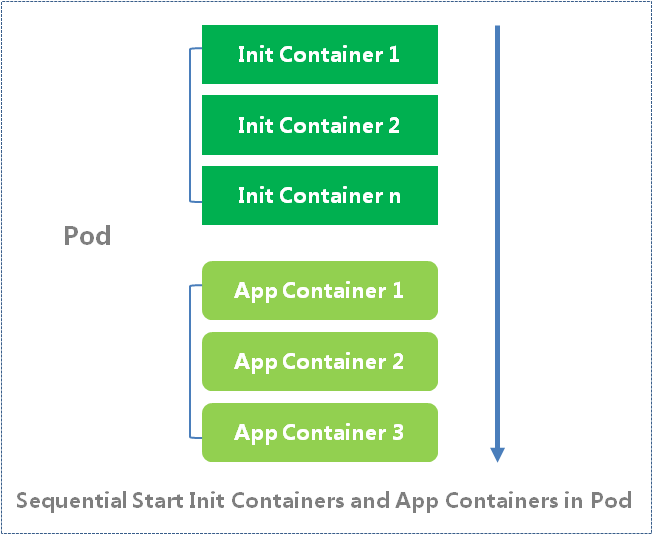
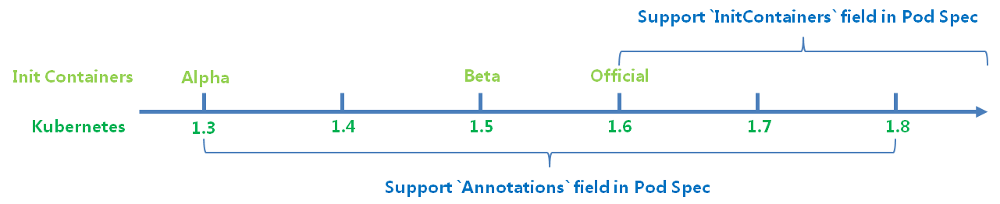
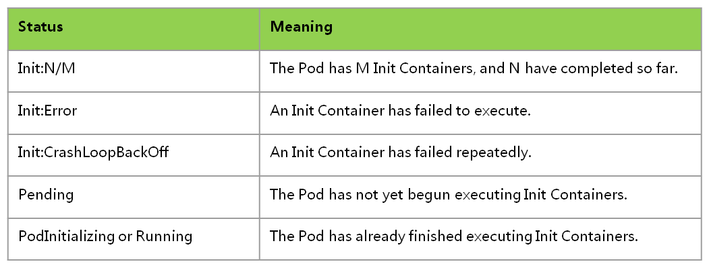

# Init Containers in Kubernetes

## 1. Introducation

In Kubernetes there is specific feature named by Init Containers.
Init Containers are exactly like regular Containers,
and all of them will be defined in the Pod Spec.
A Pod may have lots of Containers within it,
which could include one or more Init Containers and App Containers.
but Init Containers will run before the App Containers are started.
Init Containers can contain utilities or setup scripts which are not present in App Containers.
If we call a Pod like a Class, actually Init Containers are like the initialization of Class.



Init Containers and App Containers will run by the order which is defined in Pod Spec.
They will be sequential started,
which means each one must complete successfully before the next one is started.
If Init Containers start failed, App Containers will not be started.
The difference between Init Containers and App Containers is that
Init Containers always run to completion. If the Pod is restarted,
all Init Containers must execute again. By the way,
the name for Init Container or App Container must be unique among all Containers.

## 2. Evolution



Init Containers feature has its Alpha version in Kubernetes 1.3,
and has Beta version in Kubernetes 1.5. From Kubernetes 1.6,
Init Containers have the Official version,
which supports using the ```initContainers``` field in Pod Spec.
The Beta version supporting ```annotations``` field will still be respected
and overrides the ```initContainers``` field value for upgrade and downgrade,
however they are deprecated in Kubernetes 1.6 and 1.7.
In Kubernetes 1.8 or greater, the ```annotations``` are no longer supported
and must be converted to the PodSpec field.

Normally in Kubernetes the Alpha and Beta feature
will be implemented by adding values into ```annotations```.
When the feature become Official, it will have independent field like Init Containers.

* Pod Spec supporting ```annotations```:

```yaml

apiVersion: v1
kind: Pod
metadata:
  name: ubuntu
  labels:
    env: test
  annotations:
    pod.alpha.kubernetes.io/init-containers: '[
        {
            "name": "wait",
            "image": "busybox",
            "command": [
                "/bin/sh",
                "-c",
                "echo The app is running! && sleep 150"
            ]
        }
    ]'
spec:
  containers:
  - name: ubuntu
    image: ubuntu

```

* Pod Spec supporting ```Init Containers```:

```yaml

apiVersion: v1
kind: Pod
metadata:
  name: ubuntu
  labels:
    env: test
spec:
  initContainers:
  - name: wait
    image: busybox
    command: ["/bin/sh", "-c", "echo The app is running! && sleep 150"]
  containers:
  - name: ubuntu
    image: ubuntu

```

## 3. Use Cases

Init Containers are designed to meet the Kubernetes users.
The users could apply for the following use cases and so on.

* Perform initialization of shared volumes or configuration.

  When a Pod is started normally, usually there are some initialization actions
  to init local data or configuration. For example,
  the users want to release a Website and the Website code
  is existent somewhere like git repository.
  the users want to pull the lastest code and then start the Website later.
  Init Containers could fetch the lastest code into the share volumes
  and then the WebServer App Container can mount the share volumes later.
  So that the users can keep the lastest Website.

* Solve dependency relationships between App Containers.

  For example, If the users have two App Containers,
  one is Web Server, and the other one is Database.
  and the Web Server application needs to visit Database application.
  At this time the users can add an Init Container in the Web Server Pod.
  This Init Container will check whether the Database application is ready.
  Until the Database application is available, the Init Container is exited
  and the Web Server application could send a normal Database connection request.

## 4. Example

```yaml

apiVersion: v1
kind: Pod
metadata:
  name: demo
spec:
  containers:
  - name: nginx
    image: nginx
    ports:
    - containerPort: 80
    volumeMounts:
    - name: workdir
      mountPath: /usr/share/nginx/html
  initContainers:
  - name: install
    image: busybox
    command:
    - wget
    - "-O"
    - "/work-dir/index.html"
    - http://kubernetes.io
    volumeMounts:
    - name: workdir
      mountPath: "/work-dir"
  dnsPolicy: Default
  volumes:
  - name: workdir
    emptyDir: {}

```

* Create a Pod contains Init Containers by the following command:

  ```kubectl create -f demo.yaml```

  This example contains an App Container named ```nginx```
  and an Init Container named ```busybox```.
  The ```busybox``` Init Container will download the ```http://kubernetes.io```
  content into ```index.html```. The ```busybox``` Init Container and ```nginx``` App Container
  share a storage volume named ```workdir```.
  So the downloaded ```index.html``` will be existent in ```/usr/share/nginx/html```
  where is the root directory of ```nginx```.
  When the Pod is started up, the ```index.html``` will be released by ```nginx```.

## 5. Debugging

* Display the status of the pod by the following command:

  ```kubectl get pod <pod-name>```

```text

NAME      READY     STATUS     RESTARTS   AGE
ubuntu    0/1       Init:0/1   0          22m

```

* Different pods status corresponding to different Init Containers execution.



* View more detailed information about Init Container:

  ```kubectl describe pod <pod-name>```

```text

Name:         ubuntu
Namespace:    default
Node:         127.0.0.1/127.0.0.1
Start Time:   Wed, 13 Dec 2017 11:26:24 +0800
Labels:       env=test
Annotations:  <none>
Status:       Pending
IP:
Init Containers:
  wait:
    Container ID:
    Image:         busybox
    Image ID:
    Port:          <none>
    Command:
      /bin/sh
      -c
      echo The app is running! && sleep 150
    State:          Waiting
      Reason:       PodInitializing
    Ready:          False
    Restart Count:  0
    Environment:    <none>
    Mounts:
      /var/run/secrets/kubernetes.io/serviceaccount from default-token-j59m9 (ro)
Containers:
  ubuntu:
    Container ID:
    Image:          ubuntu
    Image ID:
    Port:           <none>
    State:          Waiting
      Reason:       PodInitializing
    Ready:          False
    Restart Count:  0
    Environment:    <none>
    Mounts:
      /var/run/secrets/kubernetes.io/serviceaccount from default-token-j59m9 (ro)
Conditions:
  Type           Status
  Initialized    False
  Ready          False
  PodScheduled   True
Volumes:
  default-token-j59m9:
    Type:        Secret (a volume populated by a Secret)
    SecretName:  default-token-j59m9
    Optional:    false
QoS Class:       BestEffort
Node-Selectors:  <none>
Tolerations:     node.kubernetes.io/not-ready:NoExecute for 300s
                 node.kubernetes.io/unreachable:NoExecute for 300s
Events:
  Type     Reason                  Age                 From                Message
  ----     ------                  ----                ----                -------
  Normal   Scheduled               24m                 default-scheduler   Successfully assigned ubuntu to 127.0.0.1
  Normal   SuccessfulMountVolume   24m                 kubelet, 127.0.0.1  MountVolume.SetUp succeeded for volume "default-token-j59m9"

```